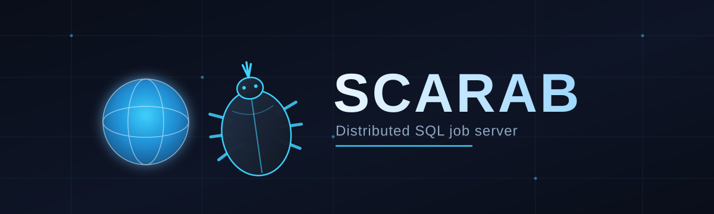
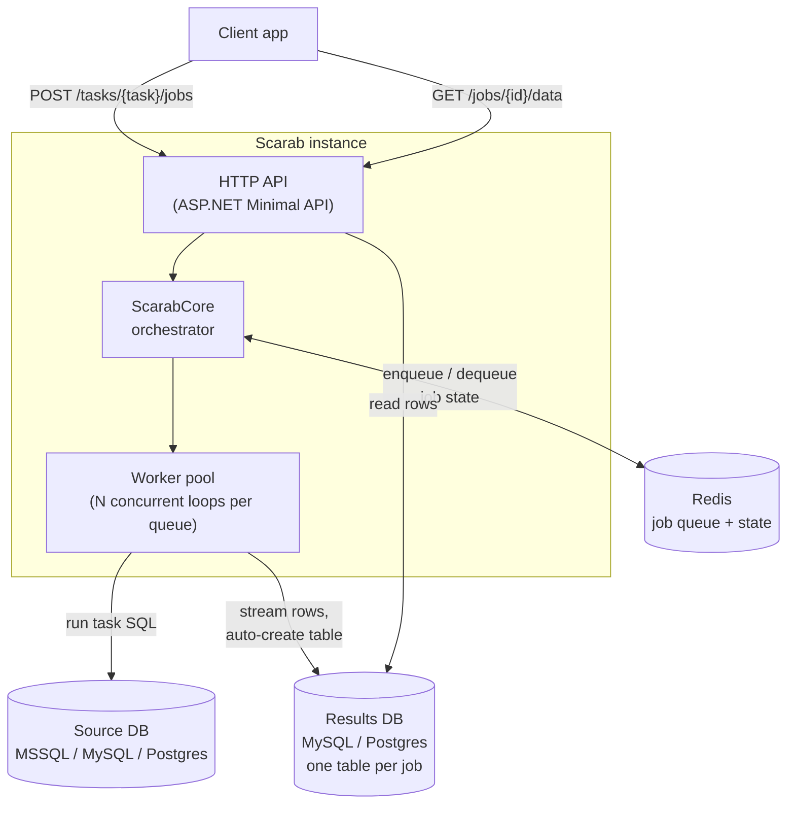

<p align="center">
  
</p>

# Scarab

**A distributed SQL job server that queues, executes, and serves the results of heavy report queries — without ever letting them block your application or your source database.**

Scarab sits between your app and your databases. Instead of running an expensive report query inline on a request thread, you submit it as a job. A pool of background workers picks it up, runs it against a source database (MSSQL, MySQL, or PostgreSQL), streams the results into a dedicated results table, and your app polls for the outcome — or just comes back later and reads it.

> Inspired by [DungBeetle](https://github.com/zerodha/dungbeetle), Zerodha's Go job server for exactly this problem. Scarab is a from-scratch C#/.NET reimagining of the same idea — same scarab-beetle metaphor, rolling SQL jobs the way a dung beetle rolls its ball.

---

## Why this exists

Report queries are a different animal from the rest of your app's traffic: they scan far more data, run far longer, and — if they run inline — hold a request thread and a DB connection hostage the whole time. Scarab takes them off that path entirely:

- **Submit and forget.** A job is queued instantly; your app gets a `job_id` back and moves on.
- **Source DBs stay protected.** Workers control concurrency per task, so a spike in report requests never turns into a spike of concurrent full-table scans on production.
- **Results live in their own table.** Each job's output goes into a dedicated `results_<job_id>` table in a separate results database — cheap to page through, cheap to drop when it expires.
- **Priority-aware.** Route different tasks to different queues, and run dedicated worker pools per queue so urgent reports don't wait behind a backlog of background ones.

## Features

- **Three source database engines** — MSSQL, MySQL, PostgreSQL — registered by name and referenced from SQL task files
- **SQL task files, not code** — drop a `.sql` file in `Sql/`, tag it with a `-- name:` comment, and it's an executable, queueable task
- **Redis-backed job queue** — configurable per-queue worker concurrency, ETA scheduling, retries
- **Job groups** — submit a batch of jobs under one group id and track their collective status
- **Auto-generated result schemas** — result table columns and types are inferred from the query's own output, no migrations to write
- **Optional source databases** — mark a source DB `Optional`, and if it's unreachable at startup the app just skips it (logs a warning) instead of failing to boot
- **Worker-only mode** — run pure queue-consumer instances with no HTTP surface
- **Interactive API docs** — a [Scalar](https://scalar.com/) reference UI, generated straight from the route definitions
- **Two ways to run it locally** — plain `docker compose up`, or a [.NET Aspire](https://learn.microsoft.com/dotnet/aspire/) AppHost with a live dashboard — both spin up an equivalent stack

## Architecture



1. A client submits a job for a named task (`POST /tasks/{task}/jobs`).
2. `ScarabCore` resolves the task, builds a job message, and pushes it onto a Redis queue. Job state (`PENDING`) is written to Redis too.
3. One of the worker pool's concurrent loops dequeues the job, runs the task's SQL against a source database, and streams each row into an auto-created `results_<job_id>` table in a results database.
4. The client polls `GET /jobs/{id}` for status, then `GET /jobs/{id}/data` (with `limit`, `all=true`, or `page`/`page_size`) once it's `SUCCESS`.

See [docs/ARCHITECTURE.md](docs/ARCHITECTURE.md) for the full component breakdown and [docs/DATA-FLOW.md](docs/DATA-FLOW.md) for sequence diagrams of every operation.

## Quick start

Both paths below start from a **clean checkout** and give you Redis, a results Postgres database, and a demo MySQL source database seeded with a small e-learning schema (`Users`, `Courses`, `Lessons`, `Enrollments`, `LessonCompletions`) — enough to run real join/aggregation queries immediately, no setup required. See [`Sql/course_analytics.sql`](Sql/course_analytics.sql) for the example tasks.

### Option A — Docker Compose

```bash
docker compose up -d --build
```

That's it — `docker compose up` alone includes the demo database by default (via a committed `.env`). A production deployment clears `COMPOSE_PROFILES` to exclude it; see [docs/CONFIGURATION.md](docs/CONFIGURATION.md).

### Option B — .NET Aspire

```bash
dotnet run --project Scarab.AppHost
```

This launches the same stack through the Aspire dashboard (with health checks, logs, and a direct link to the Scalar API docs on each resource) instead of raw `docker compose`. Useful if you're already working in the .NET tooling and want everything in one view.

### Try it

```bash
# See what's registered
curl http://localhost:6060/tasks?sql

# Run a join/aggregation query against the seeded demo data
curl -X POST http://localhost:6060/tasks/user_progress/jobs \
  -H "Content-Type: application/json" -d '{}'
# => {"status":"success","data":{"job_id":"...", ...}}

# Poll status, then read the results
curl http://localhost:6060/jobs/<job_id>
curl http://localhost:6060/jobs/<job_id>/data
```

Or skip curl entirely and browse **http://localhost:6060/scalar/v1** for interactive API docs.

### Bring your own database

Once you're past the demo, add your real source database under `Db` in `appsettings.json` (or as `SCARAB__Db__<name>__*` environment variables) and drop your own `.sql` task files into `Sql/`. Full reference: [docs/CONFIGURATION.md](docs/CONFIGURATION.md) and [docs/SQL-TASKS.md](docs/SQL-TASKS.md).

## Writing a task

A task is just a tagged SQL query. Drop it anywhere under `Sql/`:

```sql
-- name: sales_by_region
-- queue: reports
-- db: primary_pg
SELECT region, SUM(amount) AS total
FROM sales
WHERE sale_date BETWEEN @p1 AND @p2
GROUP BY region
ORDER BY total DESC;
```

```bash
curl -X POST http://localhost:6060/tasks/sales_by_region/jobs \
  -H "Content-Type: application/json" \
  -d '{"args": ["2024-01-01", "2024-03-31"]}'
```

| Tag | Meaning |
|---|---|
| `-- name:` | Required. The task's identifier in the API. |
| `-- queue:` | Which Redis queue jobs for this task go to. Defaults to the app-wide default queue. |
| `-- db:` | Restrict this task to specific source DB(s) by name. Defaults to the whole pool. |
| `-- results:` | Restrict which result backend(s) can receive this task's output. |
| `-- conc:` | Informational max concurrency for this task. |
| `-- raw:` | Skip statement preparation (`1` to enable). |

Full tag reference: [docs/SQL-TASKS.md](docs/SQL-TASKS.md).

## API at a glance

| Method | Route | Description |
|---|---|---|
| `GET` | `/tasks` | List registered tasks |
| `POST` | `/tasks/{taskName}/jobs` | Submit a job |
| `GET` | `/jobs/{jobId}` | Job status |
| `GET` | `/jobs/{jobId}/data` | Job result rows (`limit`, `all=true`, or `page`/`page_size`) |
| `GET` | `/jobs/queue/{queue}` | Pending jobs in a queue |
| `DELETE` | `/jobs/{jobId}?purge=` | Cancel/delete a job |
| `POST` | `/groups` | Submit a group of jobs |
| `GET` | `/groups/{groupId}` | Group status |
| `DELETE` | `/groups/{groupId}?purge=` | Cancel/delete a group |

Every route is fully documented — with request/response shapes and examples — at `/scalar/v1` once the app is running, or in [docs/API.md](docs/API.md).

## Project layout

```
Core/                     job orchestration, SQL task loading
DbPool/                   source-database connection pools
Queue/                    Redis-backed broker, state store, worker service
ResultBackends/           result-table schema generation and writes
Config/                   strongly-typed configuration sections
Models/                   API request/response DTOs
Sql/                      your SQL task files live here
db/mysql-init/            demo database seed script
Scarab.AppHost/           .NET Aspire orchestrator
Scarab.ServiceDefaults/   shared Aspire service defaults (health checks, telemetry)
Scarab.Tests/             xUnit test suite
docs/                     in-depth reference docs
```

## Documentation

| Doc | Covers |
|---|---|
| [ARCHITECTURE.md](docs/ARCHITECTURE.md) | Components, responsibilities, design decisions |
| [DATA-FLOW.md](docs/DATA-FLOW.md) | Sequence diagrams for every major operation |
| [API.md](docs/API.md) | Full HTTP API reference |
| [CONFIGURATION.md](docs/CONFIGURATION.md) | Every configuration option, env var overrides |
| [SQL-TASKS.md](docs/SQL-TASKS.md) | Writing and tagging SQL task files |
| [CLASS-DESIGN.md](docs/CLASS-DESIGN.md) | Class/interface reference |

## Tech stack

| | |
|---|---|
| Runtime | .NET 10, ASP.NET Core Minimal API |
| Source DB drivers | Microsoft.Data.SqlClient, MySqlConnector, Npgsql |
| Job queue | StackExchange.Redis |
| API docs | Microsoft.AspNetCore.OpenApi + Scalar |
| Local orchestration | Docker Compose, .NET Aspire |
| Tests | xUnit + NSubstitute |

## License

MIT
