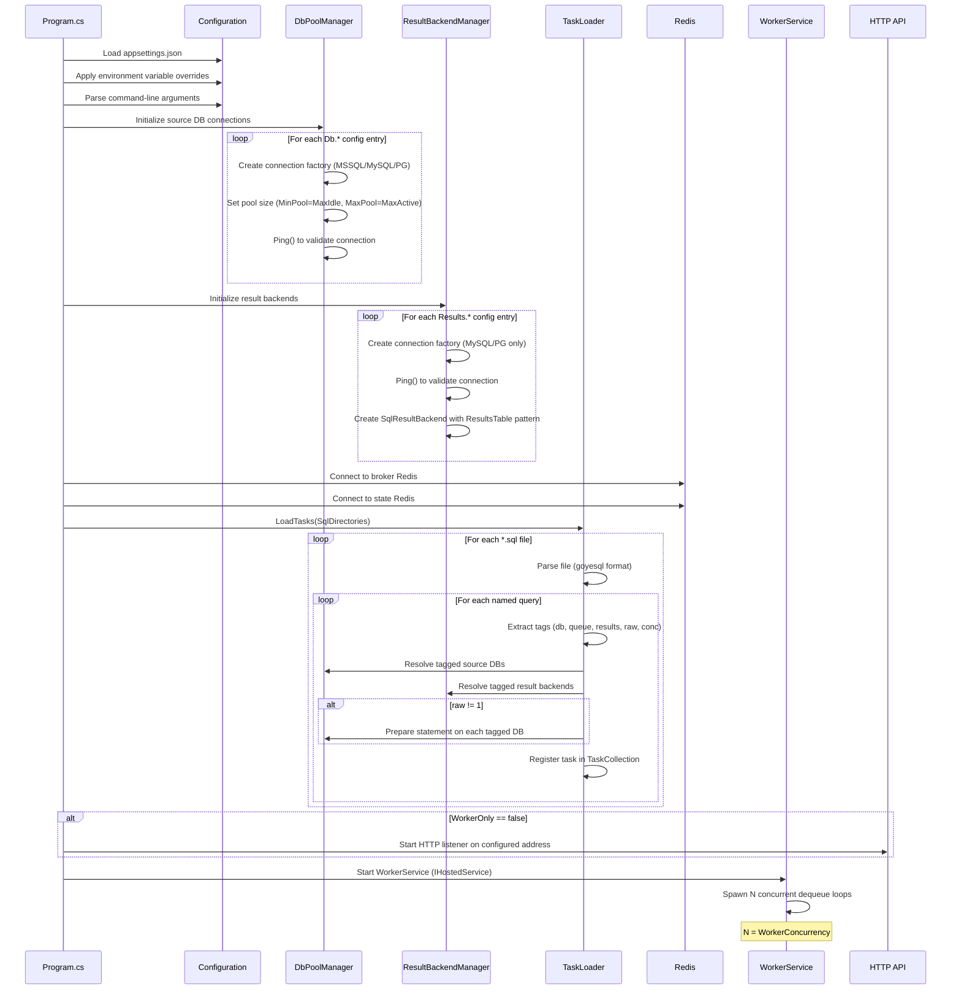
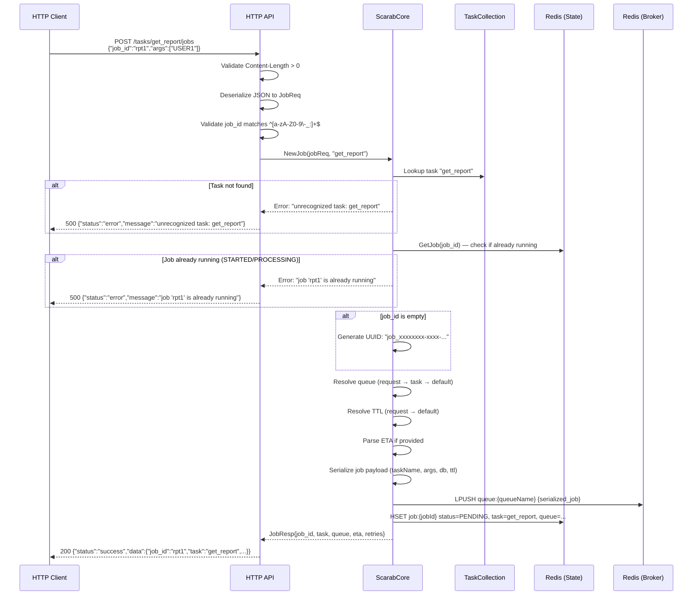
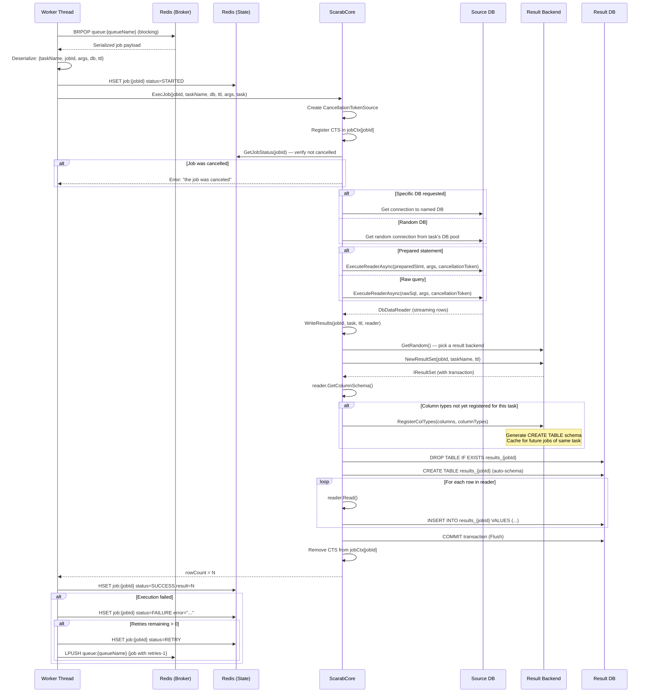
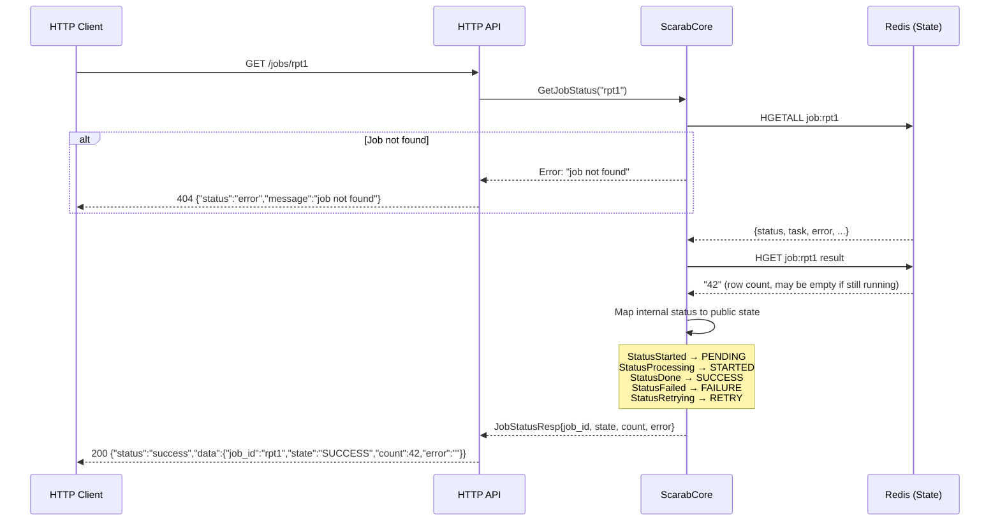
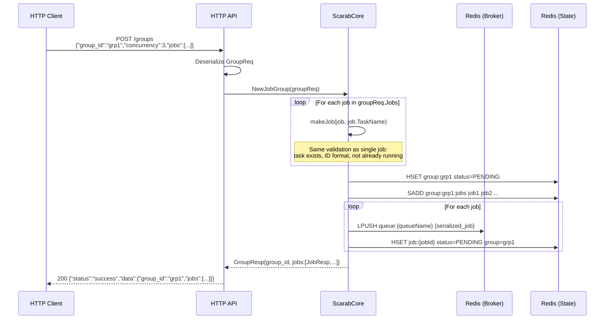
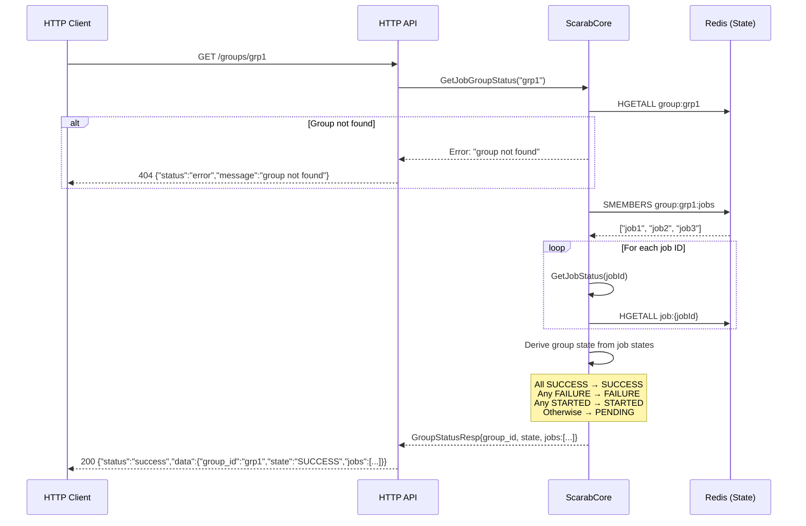
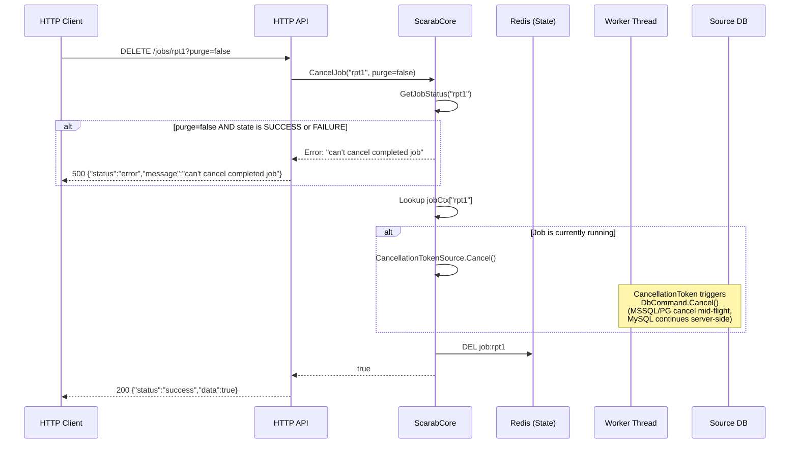
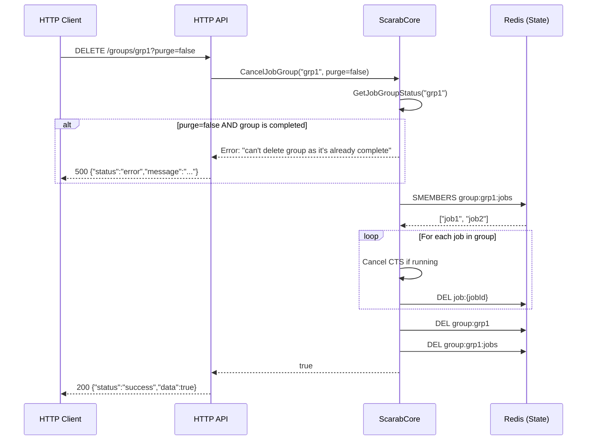
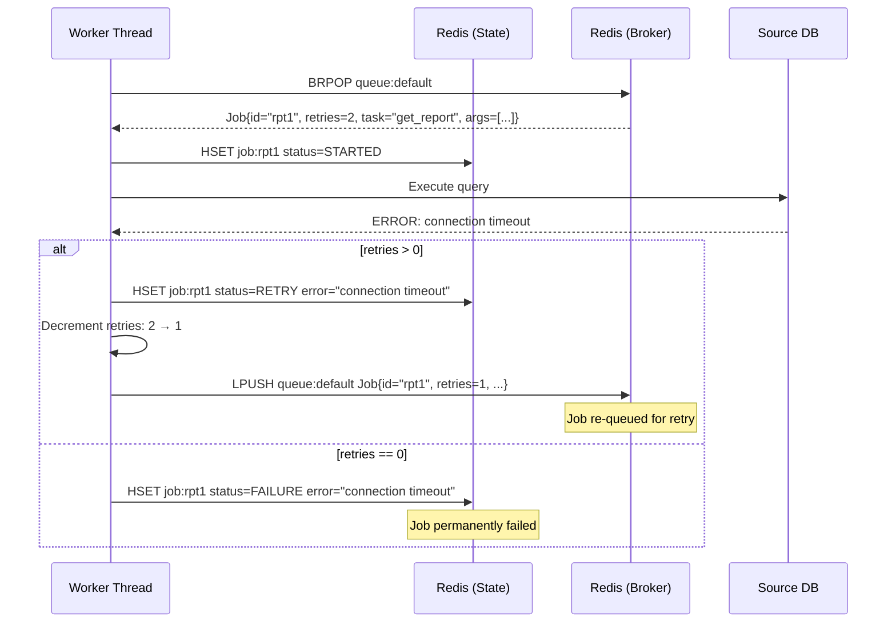
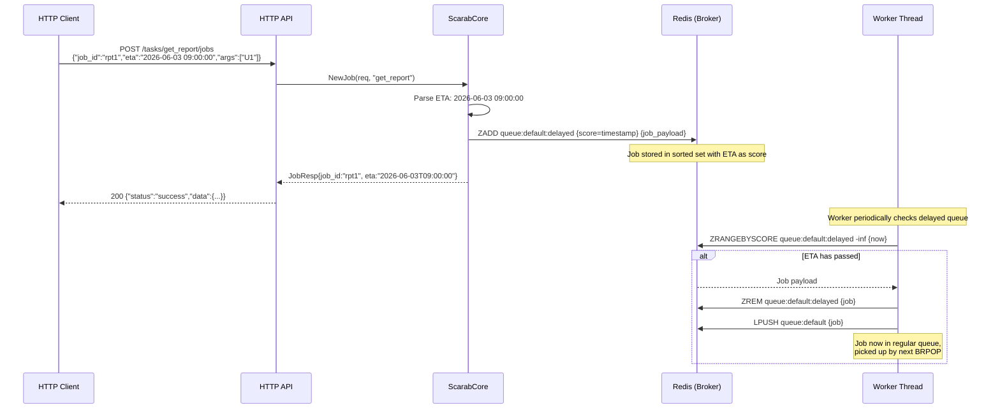

# Data Flow & Sequence Diagrams

This document details every major operation flow in Scarab with sequence diagrams.

---

## 1. Application Startup



---

## 2. Schedule a Job (POST /tasks/{taskName}/jobs)



---

## 3. Job Execution (Worker Dequeue & Execute)



---

## 4. Check Job Status (GET /jobs/{jobId})



---

## 5. Schedule a Job Group (POST /groups)



---

## 6. Check Group Status (GET /groups/{groupId})



---

## 7. Cancel a Job (DELETE /jobs/{jobId})



---

## 8. Cancel a Group (DELETE /groups/{groupId})



---

## 9. Result Table Lifecycle

```mermaid
sequenceDiagram
    participant Worker as Worker
    participant ResBackend as SqlResultBackend
    participant ResDB as Result DB

    Note over Worker: Job "rpt1" executing task "get_report"

    Worker->>ResBackend: NewResultSet("rpt1", "get_report", ttl=60s)
    ResBackend->>ResDB: BEGIN TRANSACTION
    ResBackend-->>Worker: IResultSet

    Worker->>ResBackend: RegisterColTypes(["region","total","date"], [VARCHAR,DECIMAL,DATE])
    Note over ResBackend: Generate & cache schema:<br/>DROP TABLE IF EXISTS "results_rpt1";<br/>CREATE TABLE "results_rpt1" (<br/>  "region" VARCHAR(255),<br/>  "total" DECIMAL,<br/>  "date" DATE<br/>);

    Worker->>ResBackend: WriteCols(["region","total","date"])
    ResBackend->>ResDB: DROP TABLE IF EXISTS "results_rpt1"
    ResBackend->>ResDB: CREATE TABLE "results_rpt1" (...)

    loop For each result row
        Worker->>ResBackend: WriteRow(["North", 15000.50, "2024-01-15"])
        ResBackend->>ResDB: INSERT INTO "results_rpt1" ("region","total","date") VALUES ($1,$2,$3)
    end

    Worker->>ResBackend: Flush()
    ResBackend->>ResDB: COMMIT

    Worker->>ResBackend: Close()

    Note over ResDB: Table "results_rpt1" now available<br/>for direct querying by the application
```

---

## 10. Worker Retry Flow



---

## 11. ETA (Scheduled) Job Flow


