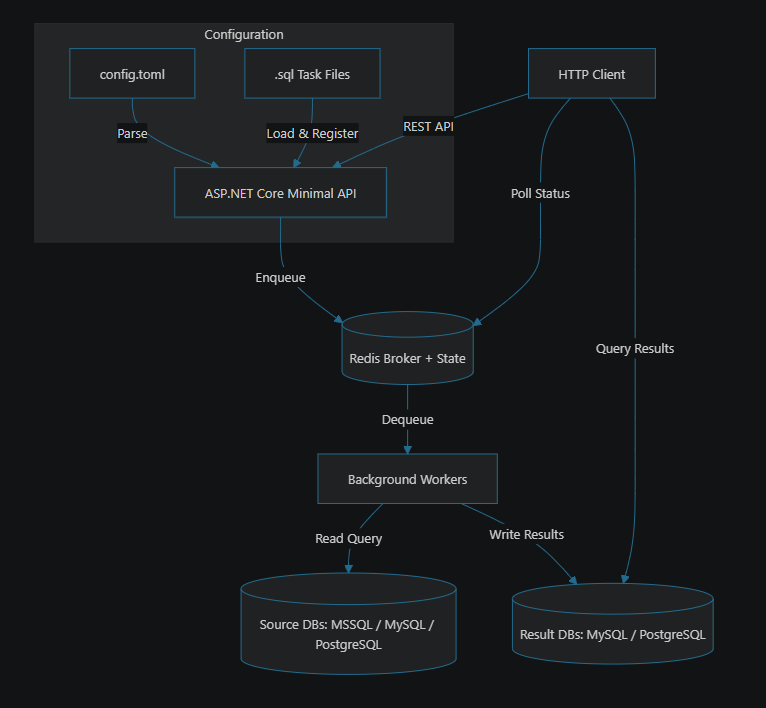
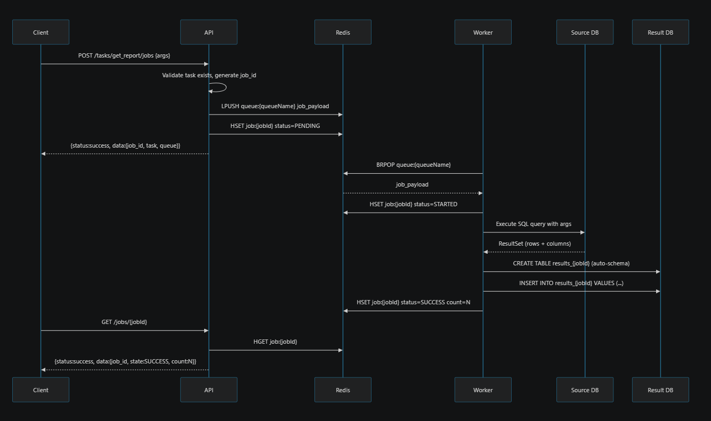

# Scarab

A distributed job server built specifically for queuing and executing heavy SQL read jobs asynchronously. A C# clone of [DungBeetle](https://github.com/zerodha/dungbeetle) — separates the reporting layer from applications.

## Overview

Scarab is a lightweight ASP.NET Core application designed for queuing and asynchronously executing large numbers of SQL read jobs (e.g., reports) against SQL databases. When read jobs are executed, results are written to separate ephemeral results databases (where every job's result is its own dedicated table), enabling faster retrieval.

### Primary Use Case

User-facing report generation in applications where requests can be queued and reports returned asynchronously without overloading large source databases.

## Supported Databases

| Role | MSSQL | MySQL | PostgreSQL |
|------|-------|-------|------------|
| **Source** (read queries from) | ✅ | ✅ | ✅ |
| **Result** (write results to) | ❌ | ✅ | ✅ |

## Features

- **Multi-database source support** — MSSQL, MySQL, PostgreSQL as source databases
- **Multi-database result support** — MySQL, PostgreSQL as result/cache databases
- **HTTP REST API** — Full API for managing jobs and groups of jobs (list, post, status check, cancel)
- **SQL task files** — Reads SQL queries from `.sql` files and registers them as executable tasks at startup
- **Distributed job queue** — Redis-backed asynchronous job queue with configurable concurrency
- **Auto-schema generation** — Result table schemas are dynamically generated from query output columns
- **Job groups** — Schedule multiple jobs as a group and track collective status
- **Job cancellation** — Cancel running/pending jobs with CancellationToken propagation
- **Worker-only mode** — Run instances as queue processors without the HTTP API
- **Multiple queues** — Route jobs to specific queues with different worker concurrency levels
- **ETA scheduling** — Schedule jobs to execute at a specific future time
- **Retry support** — Configurable retry count for failed jobs

## Architecture

High-level architecture:



Execution sequence (submit job, process, store results, poll status/data):



---

## Quick Start with Docker Compose

The included `docker-compose.yml` ships with Redis and a PostgreSQL results database ready to go. You only need to add your **source database** connection string to start running reports.

### 1. Configure Your Source Database

Edit `appsettings.json` and add your source database(s) under the `"Db"` section:

```jsonc
{
  "Db": {
    "my_mssql": {
      "Type": "mssql",
      "Dsn": "Server=YOUR_SERVER;Database=YOUR_DB;User Id=YOUR_USER;Password=YOUR_PASS;TrustServerCertificate=True;",
      "MaxActive": 50,
      "MaxIdle": 10
    }
  }
}
```

Each key (e.g. `my_mssql`) becomes a named connection you can reference in SQL task files.

**Connection string examples by database type:**

| Type | Dsn Example |
|------|-------------|
| `mssql` | `Server=10.0.0.5;Database=SalesDb;User Id=sa;Password=Pass123;TrustServerCertificate=True;` |
| `mysql` | `Server=10.0.0.5;Port=3306;Database=SalesDb;User=root;Password=Pass123;` |
| `postgres` | `Host=10.0.0.5;Port=5432;Database=SalesDb;Username=admin;Password=Pass123;` |

You can register multiple source databases — workers pick the right one per task.

### 2. Write SQL Task Files

Place `.sql` files in the `Sql/` directory. Each file can contain one or more named tasks:

```sql
-- name: monthly_sales_report
-- queue: reports
-- results: pg_results
-- conc: 3
SELECT 
    region, 
    product_name, 
    SUM(amount) AS total_sales,
    COUNT(*) AS order_count
FROM orders 
WHERE order_date BETWEEN @p1 AND @p2
GROUP BY region, product_name
ORDER BY total_sales DESC;
```

**Available tags:**

| Tag | Description | Default |
|-----|-------------|---------|
| `-- name: <name>` | **Required.** Unique task name used in API calls | — |
| `-- queue: <name>` | Queue to route jobs to | `default` |
| `-- db: <name1,name2>` | Restrict to specific source DB(s) | All source DBs |
| `-- results: <name1,name2>` | Restrict to specific result backend(s) | All result backends |
| `-- raw: 1` | Skip `PREPARE` — use raw execution | `0` (prepared) |
| `-- conc: <n>` | Max concurrent executions for this task | `10` |

**Parameter binding:**

- Parameters are positional: `@p1`, `@p2`, `@p3`, etc. in MSSQL
- PostgreSQL uses `$1`, `$2`, `$3`
- MySQL uses `@p0`, `@p1`, `@p2`
- Pass values via the `args` array in the API request

### 3. Start the Stack

```bash
docker compose up -d
```

This starts:
- **Redis** on port `6379` — job queue and state store
- **PostgreSQL** (results) on port `5433` — stores report output tables
- **Scarab** on port `6060` — API + worker

### 4. Verify Tasks Are Loaded

```bash
curl http://localhost:6060/tasks | jq
```

Response:
```json
{
  "status": "success",
  "data": ["monthly_sales_report"]
}
```

### 5. Submit a Job

```bash
curl -X POST http://localhost:6060/tasks/monthly_sales_report/jobs \
  -H "Content-Type: application/json" \
  -d '{
    "job_id": "sales-jan-2024",
    "args": ["2024-01-01", "2024-01-31"]
  }'
```

Response:
```json
{
  "status": "success",
  "data": {
    "job_id": "sales-jan-2024",
    "task_name": "monthly_sales_report",
    "queue": "reports",
    "retries": 0,
    "eta": null
  }
}
```

### 6. Check Job Status

```bash
curl http://localhost:6060/jobs/sales-jan-2024 | jq
```

Response (while running):
```json
{
  "status": "success",
  "data": {
    "job_id": "sales-jan-2024",
    "state": "STARTED",
    "count": 0,
    "error": ""
  }
}
```

Response (completed):
```json
{
  "status": "success",
  "data": {
    "job_id": "sales-jan-2024",
    "state": "SUCCESS",
    "count": 150,
    "error": ""
  }
}
```

The `count` field tells you how many rows were written to the results table.

### 7. Read the Results

You can now fetch result rows directly through the API.

Get first 100 rows (default):

```bash
curl "http://localhost:6060/jobs/sales-jan-2024/data"
```

Get all rows:

```bash
curl "http://localhost:6060/jobs/sales-jan-2024/data?all=true"
```

Get paginated rows:

```bash
curl "http://localhost:6060/jobs/sales-jan-2024/data?page=2&page_size=50"
```

Paginated response shape:

```json
{
  "status": "success",
  "data": {
    "job_id": "sales-jan-2024",
    "page": 2,
    "page_size": 50,
    "total": 150,
    "total_pages": 3,
    "count": 50,
    "data": [
      { "region": "EMEA", "total_sales": 12345.67 }
    ]
  }
}
```

You can still query the result tables directly from the results database if needed. The table name follows the pattern `results_{job_id}`:

```bash
psql -h localhost -p 5433 -U beetle -d beetle_results \
  -c "SELECT * FROM \"results_sales-jan-2024\" LIMIT 10;"
```

---

## Multi-Instance With Priority Queues

Use this pattern when you want urgent jobs to be processed faster than normal/background work.

### 1. Define queue priorities in SQL tasks

Set `-- queue:` in each task file based on priority:

```sql
-- name: high_priority_report
-- queue: high_priority
SELECT * FROM critical_reports;

-- name: default_priority_report
-- queue: default
SELECT * FROM normal_reports;

-- name: low_priority_report
-- queue: low_priority
SELECT * FROM background_reports;
```

### 2. Run multiple worker-only instances (one per queue)

Create `docker-compose.priority.yml`:

```yaml
services:
  scarab-api:
    image: reportsolution-scarab:latest
    depends_on:
      redis:
        condition: service_healthy
      results-db:
        condition: service_healthy
    ports:
      - "6060:6060"
    environment:
      SCARAB__App__WorkerOnly: "false"
      SCARAB__App__Queue: "default"
      SCARAB__App__WorkerConcurrency: "2"
      SCARAB__JobQueue__Broker__Addresses__0: redis:6379
      SCARAB__JobQueue__State__Addresses__0: redis:6379

  worker-high:
    image: reportsolution-scarab:latest
    depends_on:
      redis:
        condition: service_healthy
      results-db:
        condition: service_healthy
    environment:
      SCARAB__App__WorkerOnly: "true"
      SCARAB__App__Queue: "high_priority"
      SCARAB__App__WorkerName: "high-priority-workers"
      SCARAB__App__WorkerConcurrency: "20"
      SCARAB__JobQueue__Broker__Addresses__0: redis:6379
      SCARAB__JobQueue__State__Addresses__0: redis:6379

  worker-default:
    image: reportsolution-scarab:latest
    depends_on:
      redis:
        condition: service_healthy
      results-db:
        condition: service_healthy
    environment:
      SCARAB__App__WorkerOnly: "true"
      SCARAB__App__Queue: "default"
      SCARAB__App__WorkerName: "default-workers"
      SCARAB__App__WorkerConcurrency: "8"
      SCARAB__JobQueue__Broker__Addresses__0: redis:6379
      SCARAB__JobQueue__State__Addresses__0: redis:6379

  worker-low:
    image: reportsolution-scarab:latest
    depends_on:
      redis:
        condition: service_healthy
      results-db:
        condition: service_healthy
    environment:
      SCARAB__App__WorkerOnly: "true"
      SCARAB__App__Queue: "low_priority"
      SCARAB__App__WorkerName: "low-priority-workers"
      SCARAB__App__WorkerConcurrency: "2"
      SCARAB__JobQueue__Broker__Addresses__0: redis:6379
      SCARAB__JobQueue__State__Addresses__0: redis:6379
```

Start with both compose files:

```bash
docker compose -f docker-compose.yml -f docker-compose.priority.yml up -d --build
```

### 3. Submit jobs to specific priorities

You can route by task tag (`-- queue:`) or override queue in API request:

```bash
# Uses task's queue tag
curl -X POST http://localhost:6060/tasks/high_priority_report/jobs \
  -H "Content-Type: application/json" \
  -d '{"job_id":"urgent-001"}'

# Explicit queue override
curl -X POST http://localhost:6060/tasks/default_priority_report/jobs \
  -H "Content-Type: application/json" \
  -d '{"job_id":"manual-high-001","queue":"high_priority"}'
```

### 4. Monitor queue backlog

```bash
curl http://localhost:6060/jobs/queue/high_priority
curl http://localhost:6060/jobs/queue/default
curl http://localhost:6060/jobs/queue/low_priority
```

### Tuning guidance

- Give highest concurrency to `high_priority` workers.
- Keep API instance concurrency low if you want dedicated capacity in worker-only services.
- Add more replicas of a worker service when a queue backlog grows.
- Keep source DB pool sizes aligned with total worker concurrency across all instances.

---

## Configuration Reference

### Source Databases (`Db` section)

Register source databases to run queries against. You can add as many as needed:

```jsonc
{
  "Db": {
    "primary_pg": {
      "Type": "postgres",
      "Dsn": "Host=db1.internal;Database=app;Username=reader;Password=secret;",
      "MaxActive": 100,
      "MaxIdle": 20,
      "ConnectTimeoutSeconds": 10
    },
    "reporting_mysql": {
      "Type": "mysql",
      "Dsn": "Server=db2.internal;Database=warehouse;User=reader;Password=secret;",
      "MaxActive": 50
    },
    "legacy_mssql": {
      "Type": "mssql",
      "Dsn": "Server=db3.internal;Database=Legacy;User Id=sa;Password=secret;TrustServerCertificate=True;",
      "MaxActive": 30
    }
  }
}
```

| Field | Description | Default |
|-------|-------------|---------|
| `Type` | `mssql`, `mysql`, or `postgres` | Required |
| `Dsn` | ADO.NET connection string | Required |
| `MaxActive` | Max open connections | `100` |
| `MaxIdle` | Min idle connections in pool | `10` |
| `ConnectTimeoutSeconds` | Connection timeout | `10` |

### Result Databases (`Results` section)

Register result backends where job outputs are written. **Only MySQL and PostgreSQL** are supported as result databases:

```jsonc
{
  "Results": {
    "pg_results": {
      "Type": "postgres",
      "Dsn": "Host=results-db;Port=5432;Database=beetle_results;Username=beetle;Password=beetle123;",
      "MaxActive": 50,
      "ResultsTable": "results_{0}",
      "Unlogged": false
    }
  }
}
```

| Field | Description | Default |
|-------|-------------|---------|
| `Type` | `mysql` or `postgres` | Required |
| `Dsn` | ADO.NET connection string | Required |
| `MaxActive` | Max open connections | `100` |
| `ResultsTable` | Table name pattern (`{0}` = job_id) | `results_{0}` |
| `Unlogged` | PostgreSQL UNLOGGED tables (faster, not crash-safe) | `false` |

> **Docker Compose note:** The bundled `docker-compose.yml` already configures a PostgreSQL results database named `pg_results`. No extra config needed — just add your source DB and go.

### Environment Variable Overrides

All settings can be overridden via environment variables using `__` as the section separator:

```bash
# Source database via env var
SCARAB__Db__my_pg__Type=postgres
SCARAB__Db__my_pg__Dsn=Host=db.example.com;Database=app;Username=user;Password=pass;

# Result database via env var
SCARAB__Results__pg_results__Type=postgres
SCARAB__Results__pg_results__Dsn=Host=results.example.com;Database=results;Username=beetle;Password=pass;
```

---

## API Reference

| Method | Endpoint | Description |
|--------|----------|-------------|
| `GET` | `/` | Health check |
| `GET` | `/tasks` | List all registered SQL tasks |
| `POST` | `/tasks/{taskName}/jobs` | Submit a new job |
| `GET` | `/jobs/{jobId}` | Get job status |
| `GET` | `/jobs/{jobId}/data` | Get job result rows (default limit, all rows, or paginated) |
| `GET` | `/jobs/queue/{queue}` | List pending jobs in a queue |
| `DELETE` | `/jobs/{jobId}?purge=false` | Cancel/delete a job |
| `POST` | `/groups` | Submit a group of jobs |
| `GET` | `/groups/{groupId}` | Get group status |
| `DELETE` | `/groups/{groupId}?purge=false` | Cancel/delete a group |

### Submit a Job

```bash
curl -X POST http://localhost:6060/tasks/get_sample_report/jobs \
  -H "Content-Type: application/json" \
  -d '{
    "job_id": "my-report-001",
    "args": ["param1", "param2"],
    "queue": "reports",
    "db": "primary_pg",
    "retries": 3,
    "ttl": 120,
    "eta": "2024-12-01 10:00:00"
  }'
```

| Field | Type | Description | Required |
|-------|------|-------------|----------|
| `job_id` | string | Unique job ID (a-z, 0-9, `-`, `_`, `:`) | No (auto-generated) |
| `args` | string[] | Query parameter values (positional) | No |
| `queue` | string | Target queue name | No (uses task default) |
| `db` | string | Specific source DB name | No (random from pool) |
| `retries` | int | Max retry attempts on failure | No (0) |
| `ttl` | int | Result TTL in seconds | No (uses app default) |
| `eta` | string | Scheduled execution time (UTC) | No (immediate) |

### Submit a Job Group

```bash
curl -X POST http://localhost:6060/groups \
  -H "Content-Type: application/json" \
  -d '{
    "group_id": "quarterly-batch",
    "jobs": [
      { "task": "monthly_sales_report", "job_id": "q1-sales", "args": ["2024-01-01", "2024-03-31"] },
      { "task": "monthly_sales_report", "job_id": "q2-sales", "args": ["2024-04-01", "2024-06-30"] }
    ]
  }'
```

---

### Get Job Data

`GET /jobs/{jobId}/data`

Query options:

| Query | Type | Description |
|-------|------|-------------|
| `limit` | int | Legacy/simple mode. Returns first N rows. Default `100`, max `5000`. |
| `all` | bool | If `true`, returns all rows. Cannot be combined with `page`/`page_size`. |
| `page` | int | Page number (1-based). Must be used with `page_size`. |
| `page_size` | int | Rows per page. Must be used with `page`. Max `5000`. |

Examples:

```bash
# Default (limit=100)
curl "http://localhost:6060/jobs/my-report-001/data"

# Explicit limit mode
curl "http://localhost:6060/jobs/my-report-001/data?limit=25"

# All rows
curl "http://localhost:6060/jobs/my-report-001/data?all=true"

# Pagination
curl "http://localhost:6060/jobs/my-report-001/data?page=1&page_size=100"
```

Notes:

- `all=true` and pagination parameters cannot be used together.
- `page` and `page_size` must both be provided for paginated mode.
- Job must be in `SUCCESS` state before data can be read.

---

## SQL Task File Examples

### Simple query (uses all source DBs, default queue)
```sql
-- name: get_active_users
SELECT id, name, email FROM users WHERE active = 1;
```

### Parameterised query with specific source DB
```sql
-- name: sales_by_region
-- db: primary_pg
-- queue: reports
-- results: pg_results
SELECT region, SUM(amount) AS total
FROM sales
WHERE sale_date BETWEEN @p1 AND @p2
GROUP BY region;
```

### Raw (unprepared) query for DDL or complex statements
```sql
-- name: refresh_materialized_view
-- raw: 1
-- db: primary_pg
REFRESH MATERIALIZED VIEW CONCURRENTLY mv_daily_summary;
```

### Multiple tasks in one file
```sql
-- name: user_count
SELECT COUNT(*) AS total FROM users;

-- name: order_summary
-- queue: analytics
-- conc: 2
SELECT status, COUNT(*) AS cnt FROM orders GROUP BY status;
```

---

## Running Without Docker

```bash
# 1. Prerequisites: Redis running on localhost:6379

# 2. Configure appsettings.json with your Db and Results sections

# 3. Build and run
dotnet build
dotnet run

# 4. Run tests
cd Scarab.Tests
dotnet test
```

---

## Documentation

| Document | Description |
|----------|-------------|
| [API Specification](API.md) | Complete HTTP API reference with request/response examples |
| [Configuration Reference](CONFIGURATION.md) | All configuration options explained |
| [Architecture & Design](ARCHITECTURE.md) | System architecture, components, and design decisions |
| [SQL Task File Format](SQL-TASKS.md) | How to write and configure SQL task files |
| [Data Flow & Sequences](DATA-FLOW.md) | Sequence diagrams for all major operations |
| [Class & Interface Design](CLASS-DESIGN.md) | Detailed class hierarchy and interface contracts |

## Technology Stack

| Component | Technology |
|-----------|-----------|
| Runtime | .NET 10 / ASP.NET Core Minimal API |
| MSSQL Driver | Microsoft.Data.SqlClient |
| MySQL Driver | MySqlConnector |
| PostgreSQL Driver | Npgsql |
| Job Queue | StackExchange.Redis |
| Serialization | System.Text.Json |
| Testing | xUnit + NSubstitute |
| Containerisation | Docker multi-stage build |

## License

MIT License
